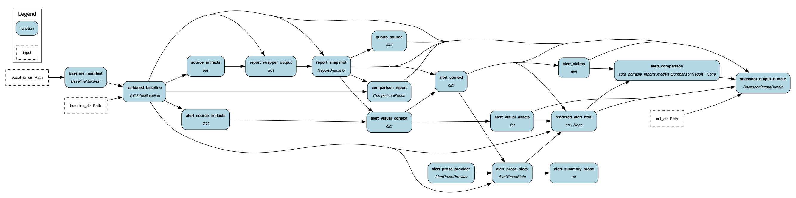

## Overview

Ahead of the Storm currently spans four submodules: forecast ingestion, impact analysis, Snowflake orchestration, and the Dash/FastAPI presentation layer. The production path is Snowflake-native, but parts of the data and report flow already support local or blob-backed artifacts.

The current architectural planning focus is a Snowflake-agnostic report publication path. See [Snowflake-Agnostic Report Publication](snowflake-agnostic-report-publication.qmd) for the recommended first slice, target interfaces, risks, and validation criteria.

## System Boundaries

- `TC-ECMWF-Forecast-Pipeline`: downloads and transforms ECMWF tropical cyclone forecast data; can keep outputs locally when Snowflake loading is disabled.
- `Ahead-of-the-Storm-DATAPIPELINE`: initializes country base layers, intersects storm envelopes with country/infrastructure layers, and writes impact artifacts and report JSON.
- `Ahead-of-the-Storm`: serves the interactive Dash dashboard, FastAPI tile sidecar, forecast analysis page, and HTML report page.
- `Ahead-of-the-Storm-ORCHESTRATION`: defines Snowflake roles, stages, tables, streams, tasks, services, materialized-table refreshes, alerts, and agent workflows.

## Portability Direction

- Keep Snowflake as a supported backend, not an assumed dependency, for report publication.
- Add explicit repository/store interfaces for forecast data, country metadata, impact artifacts, report artifacts, and static publication outputs.
- Start with a static Quarto report package for one country/storm/forecast snapshot before touching live dashboard or orchestration behavior.

## Portable Report Flow

Current implemented flow:

```text
Snowflake source tables
  -> aots-report export-snowflake
  -> Known-Good Baseline
  -> aots-report snapshot
  -> Snapshot Output Bundle
  -> aots-report publish
  -> publication-manifest.json + Quarto index
```

Trust boundaries:

- `export-snowflake` creates local baseline source artifacts and records expected-report provenance.
- Baseline validation checks manifest shape, required artifacts, checksums, schema hashes, and row counts.
- Every manifest path is resolved beneath the baseline root; absolute and parent-traversal paths are rejected before any read or publication.
- `snapshot` regenerates a report and compares it to `expected-report.json`.
- A passing comparison is certifying only when `expected-report.json` has independent trusted-current-output provenance.
- `publish` consumes Snapshot Output Bundles, not raw baselines.
- A versioned Alert Decision artifact supplies official current state, country threat, hazard availability, and the operational Product Decision to portable alert rendering.
- Portable rendering consumes the Product Decision and never infers Warning or Alert from wind thresholds.
- The next-stage cross-repository seam is a checksummed semantic ProductFactSet v2 artifact. Root will consume facts rather than reconstructing policy-shaped content from generic report keys.
- PresentationProfile and CompositionManifest are root-owned publication contracts; they never participate in Product Decision identity.
- Expected Alert Email HTML is optional provenance-qualified reference evidence copied into the bundle, not a rendering prerequisite or current alert-comparison input.
- Orchestration owns the dry-run basin authority map, local exact-feed client/parser, advisory normalization, identity/threat/lifecycle modules, product facts, and classifier. Scheduled Snowflake network retrieval and deployment remain disabled.

The implemented local composition and proposed Snowflake persistence path is:

```text
configured NHC/CPHC RSS feed
  -> paired Public + Forecast Advisory parser
  -> Current Storm State
  -> explicit Storm Identity Reconciliation
  -> Country Office Registry + 144-hour 34kt Threat Assessment
  -> Warning/Alert Product Decision
  -> country lifecycle transition
  -> deterministic V1 Summary / Situation / Forecast facts
  -> recipient attempts marked SUPPRESSED_DRY_RUN
  -> in-memory dry-run policy result
```

The policy engine refuses operational mode. A content-addressed release builder materializes verified source copies and generates a runtime hash-checking Snowflake UDF entrypoint. Policy table schemas exist, but no Snowflake writer is shipped: persistence remains blocked until an owner procedure can recompute every identity and pass isolated-account concurrency/privacy tests. Deployment networking, scheduled ingestion, legacy-procedure cutover, and email delivery are not enabled.

The committee-approved next-stage publication path is:

```text
Orchestration Product Decision + semantic ProductFactSet v2
  -> checksummed product_fact_set artifact
  -> root PresentationProfile v1
  -> CompositionManifest v1
  -> rendered/publication artifacts in Snapshot Output Bundle
```

The first profile reproduces the existing long output for claim parity. Operational-email and technical-report profiles follow a consultation checkpoint. Snowflake persistence, private recipients, delivery providers, attachments, and sends remain outside this path.

Current module map:

- `src/aots_portable_reports/cli.py`: command entry points.
- `src/aots_portable_reports/export_snowflake.py`: read-only Snowflake baseline export.
- `src/aots_portable_reports/validation.py`: baseline integrity checks.
- `src/aots_portable_reports/models.py`: versioned alert decision and baseline contracts.
- `src/aots_portable_reports/dag.py`: Hamilton snapshot materialization flow.
- `src/aots_portable_reports/report_wrapper.py`: thin wrapper around current `do_report(...)` behavior.
- `src/aots_portable_reports/comparison.py`: comparison and certification-state logic.
- `src/aots_portable_reports/local_adapter.py`: local Snapshot Output Bundle discovery.
- `src/aots_portable_reports/publication.py`: publication manifest and Quarto index generation.

## Hamilton DAG

The snapshot materialization flow is implemented as a Hamilton DAG in `src/aots_portable_reports/dag.py`. Alert context now depends on the validated Alert Decision artifact, while expected alert HTML is copied only as optional provenance-qualified reference evidence. The graph below is generated from the current Python module with Hamilton's `display_all_functions(...)`, so it reflects the actual node dependencies used by `aots-report snapshot`.

{fig-alt="Hamilton DAG showing baseline validation, report generation, alert context and visual asset generation, comparisons, Quarto source creation, and Snapshot Output Bundle materialization."}

To regenerate the image after DAG changes:

```bash
uv run python - <<'PY'
from pathlib import Path
from hamilton import driver
from aots_portable_reports import dag

out = Path('docs/assets/architecture/portable-report-hamilton-dag.png')
driver.Driver({}, dag).display_all_functions(str(out), render_kwargs={'format': 'png'})
PY
```

## Generated Assets

This repository vendors generated assets from `repo-familiar`. Provenance is recorded in `.repo-familiar/bootstrap.yml`.

Key generated asset groups:

- `AGENTS.md` records working defaults, selected harnesses, profiles, and skills.
- `.agents/models.yml` records non-secret model defaults compatible with `opencode` and `paseo`.
- `.agents/tools.yml` records non-secret tool guidance for CQ, accessibility, browser automation, Headroom, and OpenCode MCP integration.
- `.agents/skills/` vendors the selected skills so agent workflows are self-contained.
- `opencode.json` registers `.agents/skills` and project-local MCP entries for Playwright, CQ, Headroom, and Context7.
- `.repo-familiar/bootstrap.yml` records selected options and content checksums for generated assets.

`paseo` does not require a repository-local config file here. Paseo supervises agents, terminals, schedules, and worktrees through user-owned machine-level state such as `~/.paseo`, so this repository only records harness compatibility and worktree guidance.
