This page records real exported comparison cases used to check the portable report and alert workflow against the current Snowflake-backed system. The screenshots for Jamaica and Cuba are committed intentionally: they are real Snowflake alert-agent email renderings and local portable alert renderings for the listed cases.

These examples are not public-release approval. They are implementation evidence for report comparison, alert parity, and visual asset generation.

The visual alignment target for the portable renderer is described in [Alert Email Design](alert-email-design.qmd).

## Summary

| Case | Inferred storm | Forecast time | Report comparison | Alert comparison | Visual assets | Notes |
| --- | --- | --- | --- | --- | --- | --- |
| JAM 28 Oct 00Z | MELISSA | 2025-10-28T00:00:00Z | passed, `provisional_comparison` | passed | 7 PNGs | Snowflake expected email and local rendered alert both available. |
| CUB 29 Oct 00Z | MELISSA | 2025-10-29T00:00:00Z | passed, `provisional_comparison` | passed | 6 PNGs | Snowflake expected email and local rendered alert both available; people-in-need donut omitted because source values were unavailable. |
| PHL 6 May 18Z | HAGUPIT | 2026-05-06T18:00:00Z | passed, `provisional_comparison` | not available | 6 PNGs | No matching `ALERT_SENT_LOG.EMAIL_BODY` row was found, so no expected alert email was exported. |

All report comparisons here are provisional because the exported baselines use portable-wrapper-generated `expected-report.json` values unless manually replaced by independent current report JSON.

## Artifacts Checked

The tested Snapshot Output Bundles were generated locally under `/tmp`:

| Case | Snapshot Output Bundle | Report failures | Report warnings | Alert failures | Alert warnings |
| --- | --- | ---: | ---: | ---: | ---: |
| JAM / MELISSA | `/tmp/aots-check-melissa-jam-2025102800` | 0 | 0 | 0 | 0 |
| CUB / MELISSA | `/tmp/aots-check-melissa-cub-2025102900` | 0 | 0 | 0 | 0 |
| PHL / HAGUPIT | `/tmp/aots-check-hagupit-phl-2026050618` | 0 | 0 | n/a | n/a |

Visual asset inventories:

| Case | Generated alert visual assets |
| --- | --- |
| JAM / MELISSA | `population-composition-50kt.png`, `people-in-need-composition-50kt.png`, `impact-evolution-50kt.png`, `admin-choropleth-50kt.png`, `ensemble-probability-50kt.png`, `ensemble-probability-34kt.png`, `ensemble-probability-64kt.png` |
| CUB / MELISSA | `population-composition-50kt.png`, `impact-evolution-50kt.png`, `admin-choropleth-50kt.png`, `ensemble-probability-50kt.png`, `ensemble-probability-34kt.png`, `ensemble-probability-64kt.png` |
| PHL / HAGUPIT | `population-composition-50kt.png`, `people-in-need-composition-50kt.png`, `impact-evolution-50kt.png`, `admin-choropleth-50kt.png`, `ensemble-probability-50kt.png`, `ensemble-probability-34kt.png` |

## Visual Alignment Checklist

The portable rendered alert now follows the Snowflake-aligned layout target from [Alert Email Design](alert-email-design.qmd). These checks were observed in the refreshed JAM and CUB rendered-alert screenshots:

| Alignment item | JAM / MELISSA | CUB / MELISSA | Notes |
| --- | --- | --- | --- |
| Branded header and urgency strip | yes | yes | Uses portable theme tokens, not exact Snowflake CSS. |
| Bounded prose slots | yes | yes | Summary, overview, shift, and oscillation slots are present with fallback text when replay cannot extract a section. |
| Timing and forecast details before impact sections | yes | yes | Portable output now includes threshold-arrival timing from exported Snowflake timing artifacts. |
| Primary 50kt probability map before secondary maps | yes | yes | 34kt/64kt maps follow as secondary visual views. |
| Donut/composition charts | yes | partial | CUB has population composition; people-in-need composition is omitted because values were unavailable. |
| Admin choropleth before admin table | yes | yes | Matches the expected-impact/admin-information flow. |
| Forecast evolution before caveats/footer | yes | yes | Chart appears near the lower narrative/review section. |
| Claim-based alert comparison | passed | passed | Exact prose and pixel parity remain out of scope. |

## Jamaica / Melissa

Country/date request: `JAM 28 Oct 00Z`  
Inferred storm: `MELISSA`  
Forecast time: `2025-10-28T00:00:00Z`

The Snowflake alert-agent email was exported from `ALERT_SENT_LOG.EMAIL_BODY` as `expected-alert.html`. The portable flow generated `rendered-alert.html` from structured report inputs, baseline-replayed prose, and generated visual PNG assets.

::: {.columns}
::: {.column width="50%"}
### Snowflake alert-agent email

{fig-alt="Full-page screenshot of the Snowflake alert-agent expected email for Jamaica and Storm Melissa at 2025-10-28 00Z."}
:::

::: {.column width="50%"}
### Portable rendered alert

{fig-alt="Full-page screenshot of the portable rendered alert email for Jamaica and Storm Melissa at 2025-10-28 00Z."}
:::
:::

### Jamaica Visual Asset Pair Review

These pairs compare visual assets extracted from the Snowflake alert-agent email with the portable renderer's generated visual assets. They are implementation-review aids, not pixel-parity gates.

| Visual | Snowflake alert-agent | Portable renderer |
| --- | --- | --- |
| Composition: people / population | {fig-alt="Snowflake people arc for Jamaica Melissa." width="260"} | 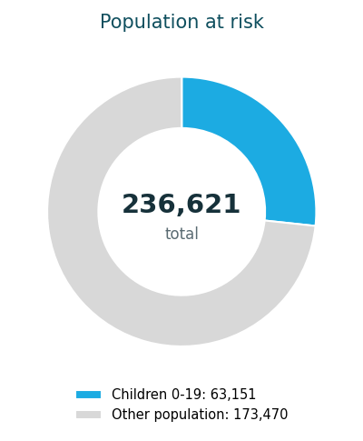{fig-alt="Portable population composition donut chart for Jamaica Melissa." width="260"} |
| Composition: children / people in need | 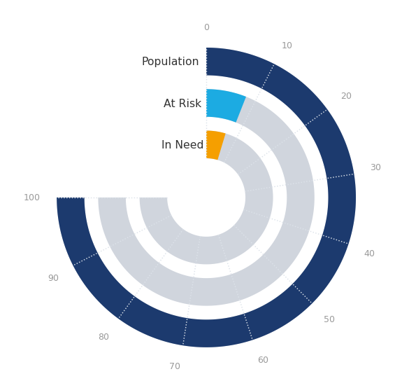{fig-alt="Snowflake children arc for Jamaica Melissa." width="260"} | 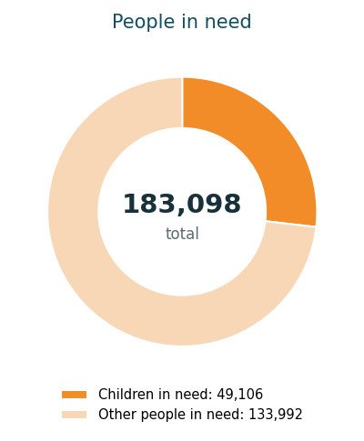{fig-alt="Portable people-in-need composition donut chart for Jamaica Melissa." width="260"} |
| 50kt wind exposure probability | 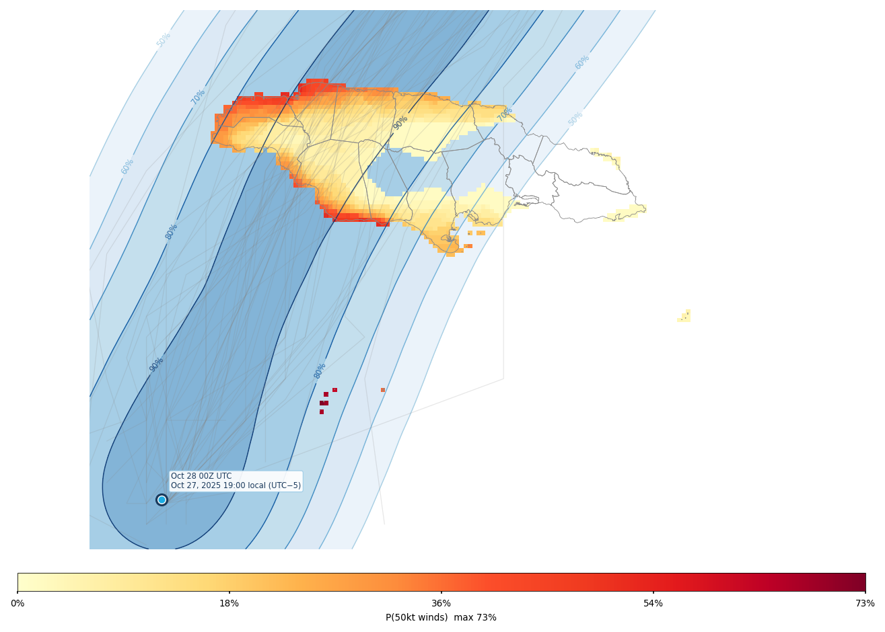{fig-alt="Snowflake 50kt wind exposure probability map for Jamaica Melissa." width="360"} | 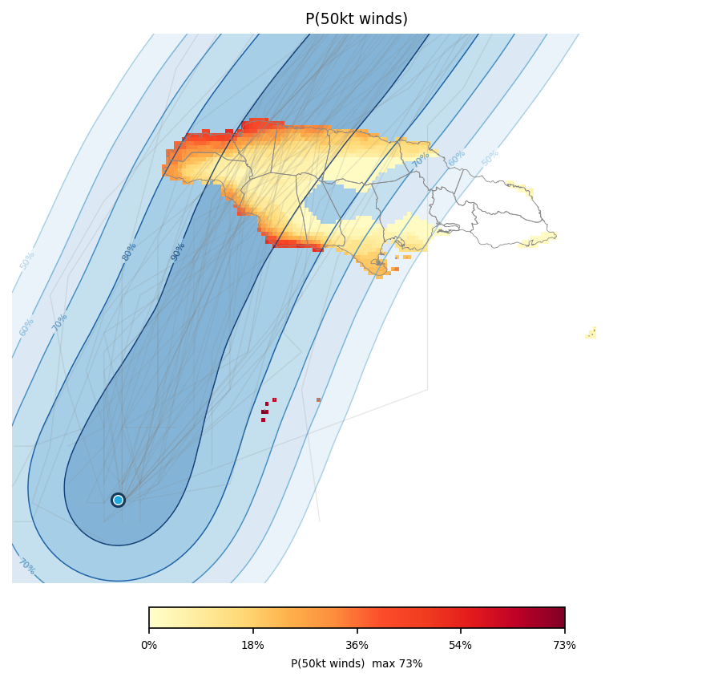{fig-alt="Portable 50kt wind exposure probability map for Jamaica Melissa." width="360"} |
| 34kt wind exposure probability | 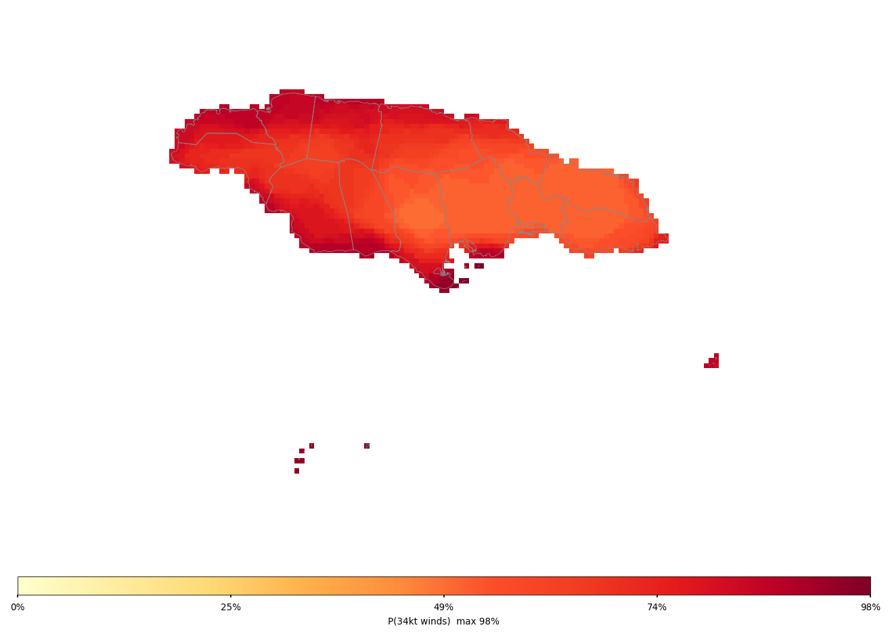{fig-alt="Snowflake 34kt wind probability map for Jamaica Melissa." width="320"} | 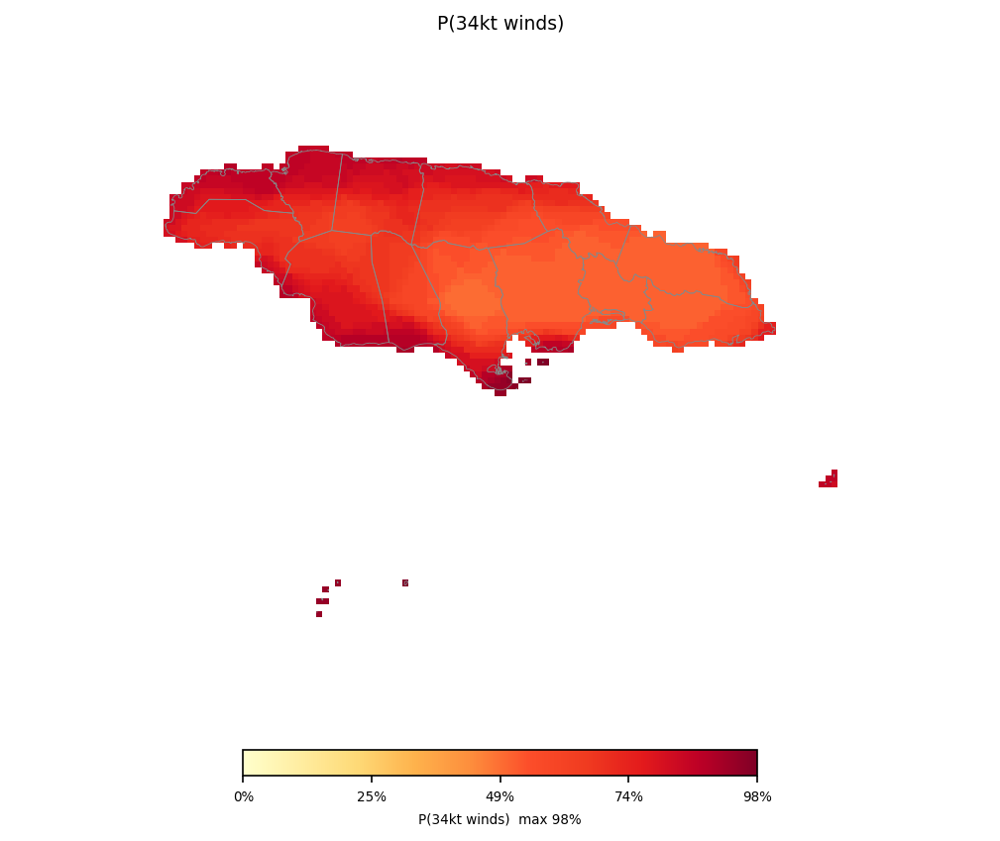{fig-alt="Portable 34kt wind exposure probability map for Jamaica Melissa." width="320"} |
| 64kt wind exposure probability | 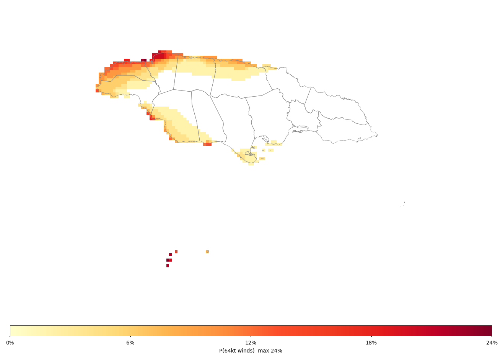{fig-alt="Snowflake 64kt wind probability map for Jamaica Melissa." width="320"} | 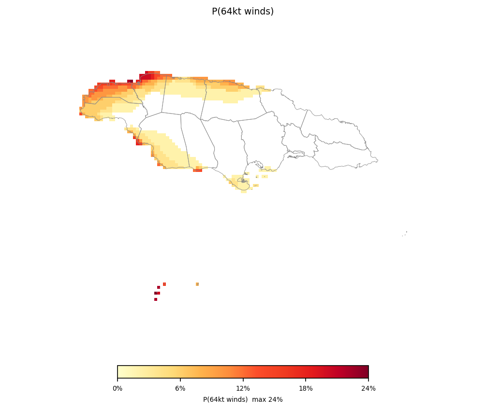{fig-alt="Portable 64kt wind exposure probability map for Jamaica Melissa." width="320"} |
| Admin impact map | {fig-alt="Snowflake admin impact map for Jamaica Melissa." width="360"} | 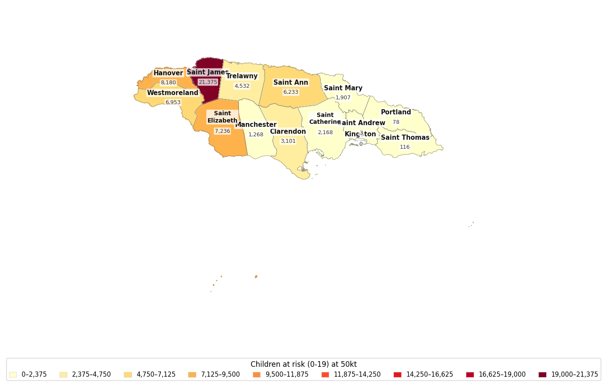{fig-alt="Portable admin impact map for Jamaica Melissa." width="360"} |
| Forecast evolution chart | 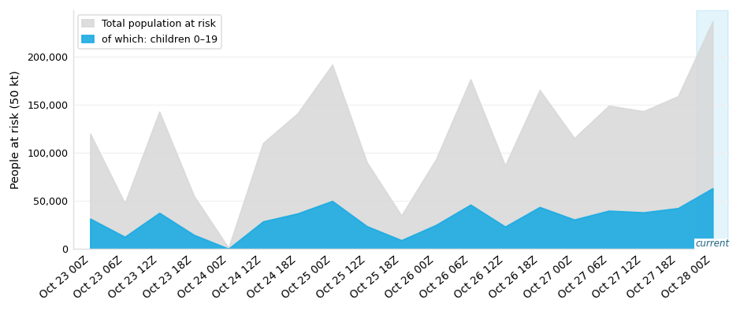{fig-alt="Snowflake forecast evolution chart for Jamaica Melissa." width="360"} | 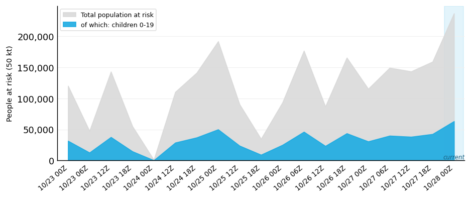{fig-alt="Portable forecast evolution chart for Jamaica Melissa." width="360"} |

### Jamaica Narrative Pair Review

| Section | Snowflake alert-agent | Portable renderer | Review note |
| --- | --- | --- | --- |
| Situation summary | Storm Melissa threatens 236,621 people in Jamaica with strong storm-force winds, including 63,150 children at risk. Saint James parish faces the highest exposure, carrying 34.4% of national risk. | Storm Melissa threatens 236,621 people in Jamaica with strong storm-force winds, including 63,150 children at risk. Saint James parish faces the highest exposure, carrying 34.4% of the national risk. | Closely aligned after Baseline Replay cleanup removes inline `data` labels and truncates copied table/list spillover. |
| Situation overview | Strong storm-force winds could affect 236,621 people across Jamaica, with Saint James and western parishes carrying the heaviest exposure. | Replayed into the bounded `narrative` slot when extractable; otherwise the renderer falls back to a short structured-facts sentence. | Exact prose is not required, but key facts should remain in tables and charts. |
| Forecast shift | Snowflake describes the expected footprint as broadly stable geographically while exposure levels change. | Portable renderer uses the bounded `shift` slot when extractable, otherwise a short fallback. | Future work should compare shift claims from structured previous-run data, not prose. |

### Jamaica Table Pair Review

| Table | Snowflake alert-agent | Portable renderer | Review note |
| --- | --- | --- | --- |
| Timing / arrival | Dedicated table with 34kt, 50kt, and 64kt consensus arrival, earliest/latest window, and scenario count. | Portable Timing & Forecast Details now includes a threshold-arrival table with consensus arrival, earliest/latest window, and scenario count. | Timing gap substantially closed; formatting still differs slightly. |
| Cross-threshold exposure | Cross-threshold table with population, children, schools, health centers, shelters, and WASH for each wind speed. | Threshold Exposure table now includes population, children, schools, health centers, shelters, and WASH across wind thresholds. | Facility-column gap closed for this table. |
| Expected impact | Includes at-risk and in-need columns plus child age-band rows. | Expected Impact and People in Need are split into two deterministic tables. | Same core values are present; portable layout is more normalized but less visually compact. |
| Admin impact | Snowflake orders by the active alert ranking: Saint James, Hanover, Saint Elizabeth, Westmoreland, Saint Ann, with population, PIN, children, CHIN, and facility columns. | Portable table now sorts by 50kt population exposure and includes schools, health centers, shelters, and WASH columns. | Ordering and facility-column gaps are closed; delta arrows and child/PIN age-band columns remain future work. |

## Cuba / Melissa

Country/date request: `CUB 29 Oct 00Z`  
Inferred storm: `MELISSA`  
Forecast time: `2025-10-29T00:00:00Z`

The Snowflake alert-agent email was exported from `ALERT_SENT_LOG.EMAIL_BODY` as `expected-alert.html`. The portable flow generated `rendered-alert.html` with matching claim-level alert parity and visual asset sections.

::: {.columns}
::: {.column width="50%"}
### Snowflake alert-agent email

{fig-alt="Full-page screenshot of the Snowflake alert-agent expected email for Cuba and Storm Melissa at 2025-10-29 00Z."}
:::

::: {.column width="50%"}
### Portable rendered alert

{fig-alt="Full-page screenshot of the portable rendered alert email for Cuba and Storm Melissa at 2025-10-29 00Z."}
:::
:::

### Cuba Visual Asset Pair Review

The Cuba Snowflake alert-agent email exposes the map/chart images but no standalone people/children arc images. The portable renderer still emits a population composition donut because the structured source values are available.

| Visual | Snowflake alert-agent | Portable renderer |
| --- | --- | --- |
| Composition: population | No standalone Snowflake composition image was extracted for this case. | 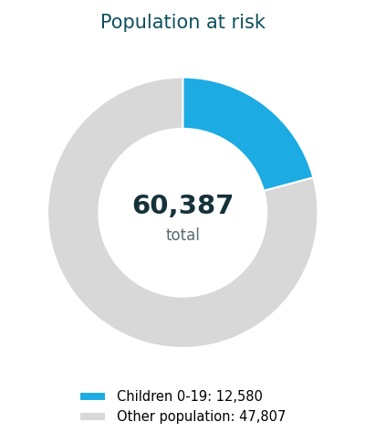{fig-alt="Portable population composition donut chart for Cuba Melissa." width="260"} |
| 50kt wind exposure probability | 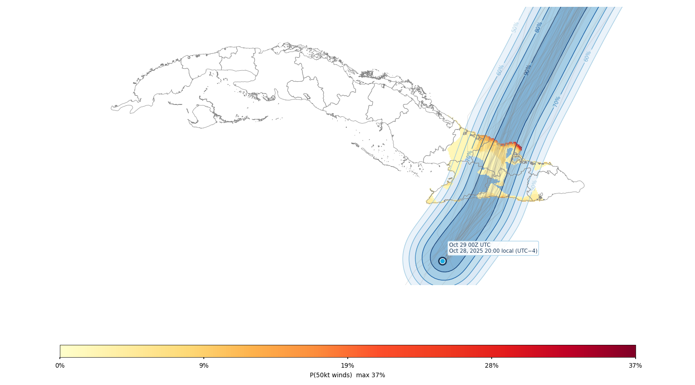{fig-alt="Snowflake 50kt wind exposure probability map for Cuba Melissa." width="360"} | 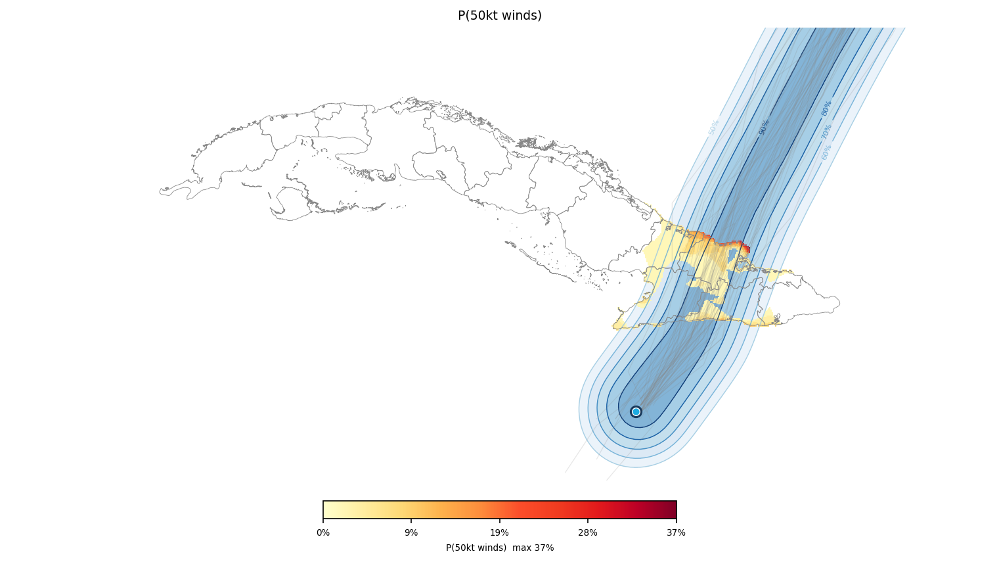{fig-alt="Portable 50kt wind exposure probability map for Cuba Melissa." width="360"} |
| 34kt wind exposure probability | 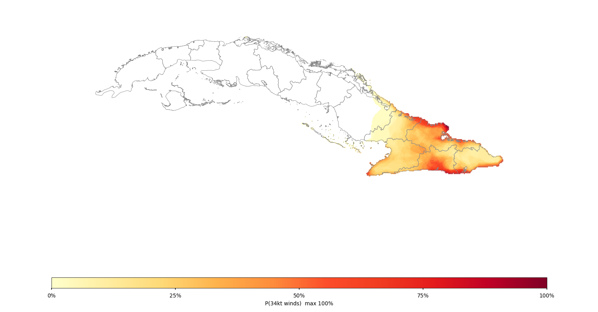{fig-alt="Snowflake 34kt wind probability map for Cuba Melissa." width="320"} | 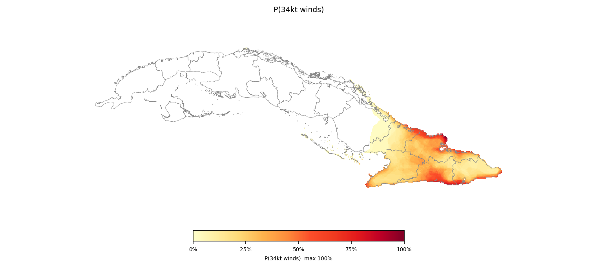{fig-alt="Portable 34kt wind exposure probability map for Cuba Melissa." width="320"} |
| 64kt wind exposure probability | 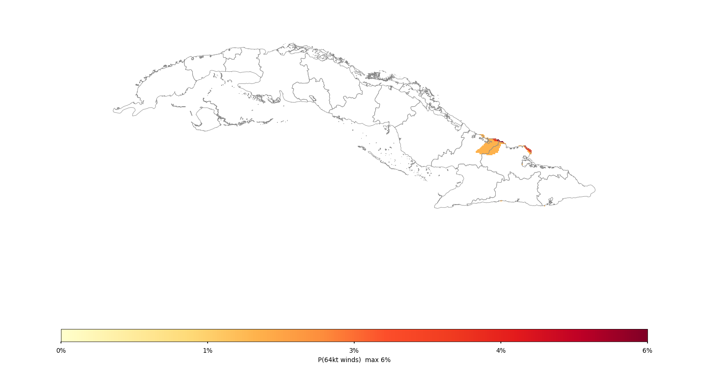{fig-alt="Snowflake 64kt wind probability map for Cuba Melissa." width="320"} | 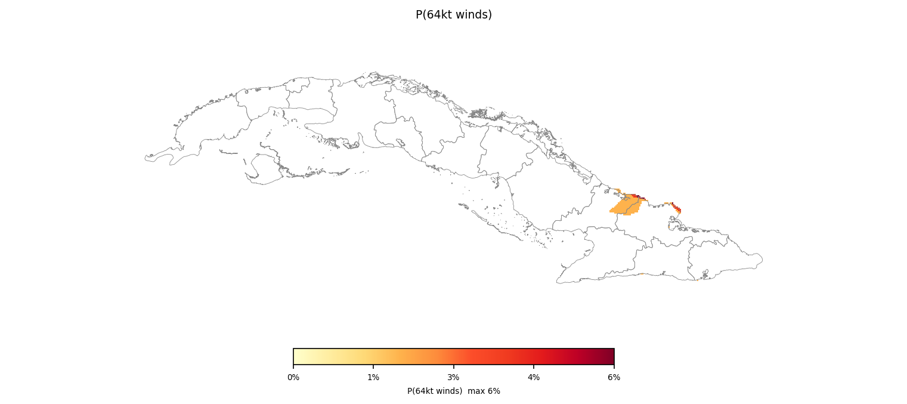{fig-alt="Portable 64kt wind exposure probability map for Cuba Melissa." width="320"} |
| Admin impact map | {fig-alt="Snowflake admin impact map for Cuba Melissa." width="360"} | 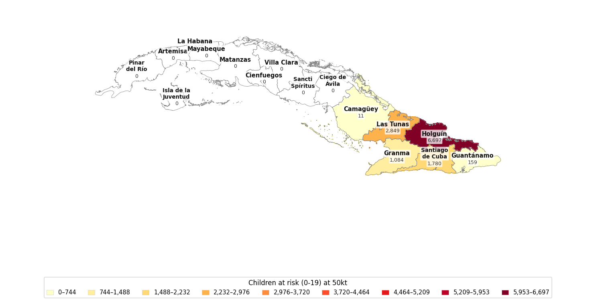{fig-alt="Portable admin impact map for Cuba Melissa." width="360"} |
| Forecast evolution chart | 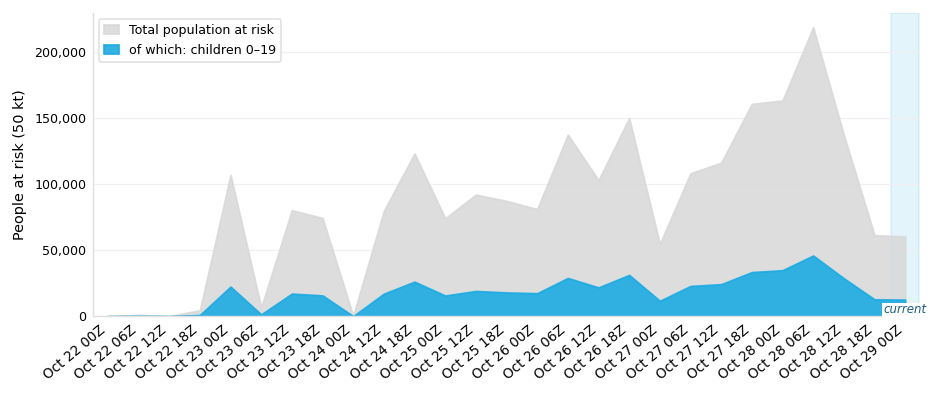{fig-alt="Snowflake forecast evolution chart for Cuba Melissa." width="360"} | 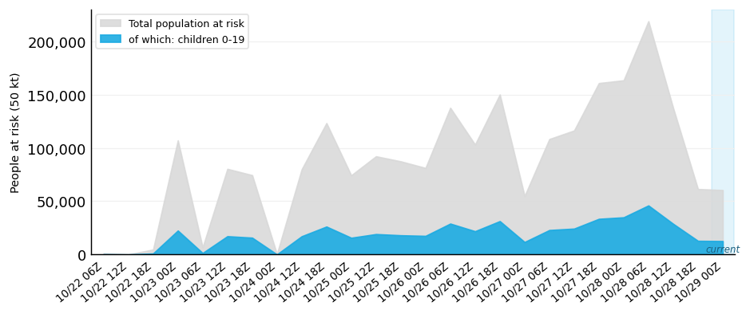{fig-alt="Portable forecast evolution chart for Cuba Melissa." width="360"} |

### Cuba Narrative Pair Review

| Section | Snowflake alert-agent | Portable renderer | Review note |
| --- | --- | --- | --- |
| Situation summary | Storm MELISSA threatens 60,387 people in Cuba with strong storm-force winds, putting 12,579 children at risk. Holguín province faces the greatest danger. | Storm MELISSA threatens 60,387 people in Cuba with strong storm-force winds, putting 12,579 children at risk. Holguín province faces the greatest danger, accounting for over half of national exposure. | Closely aligned after cleanup; grammar normalization changes `an decrease` to `a decrease` when replayed. |
| Situation overview | Snowflake names Holguín, Las Tunas, and Santiago de Cuba as main exposed provinces. | Portable renderer replays the bounded overview prose when extractable. | Good candidate for future structured narrative claims by named admin area. |
| Forecast shift | Snowflake describes mixed exposure changes across provinces. | Portable renderer uses bounded shift prose or fallback text. | Shift comparison still needs stronger structured previous-run claims. |

### Cuba Table Pair Review

| Table | Snowflake alert-agent | Portable renderer | Review note |
| --- | --- | --- | --- |
| Timing / arrival | Dedicated threshold-arrival table for 34kt, 50kt, and 64kt, with scenario count. | Portable Timing & Forecast Details now includes a threshold-arrival table with consensus arrival, earliest/latest window, and scenario count. | Timing gap substantially closed; formatting still differs slightly. |
| Cross-threshold exposure | Includes population, children, schools, health centers, shelters, and WASH for each threshold. | Threshold Exposure table now includes population, children, schools, health centers, shelters, and WASH across thresholds. | Facility-column gap closed for this table. |
| Expected impact | Expected-at-risk table includes population, children, age bands, schools, health centers, shelters, and WASH. | Expected Impact has totals; People in Need says no values available. | The CUB baseline lacks `E_people_in_need` / `E_children_in_need`, so the in-need table and donut are intentionally omitted. |
| Admin impact | Snowflake top rows: Holguín, Las Tunas, Santiago de Cuba, Granma, Guantánamo, with population, children, and facility columns. | Portable table now sorts by 50kt population exposure and includes schools, health centers, shelters, and WASH columns. | Ordering and facility-column gaps are closed; delta arrows and child age-band columns remain future work. |

## Philippines / Hagupit

Country/date request: `PHL 6 May 18Z`  
Inferred storm: `HAGUPIT`  
Forecast time: `2026-05-06T18:00:00Z`

Snowflake source impact artifacts were available, and the portable report comparison passed provisionally. No matching row existed in `ALERT_SENT_LOG.EMAIL_BODY`, so the export did not include `expected-alert.html` and the snapshot did not produce an alert comparison. The DAG still generated local visual assets from source artifacts, which confirms the map/chart portion can run when the source data is present.

## Reproduction Commands

These commands assume Snowflake credentials are available through `.env` and write real baselines only to ignored local paths.

```bash
uv run aots-report export-snowflake \
  --country JAM \
  --storm MELISSA \
  --forecast-time 2025-10-28T00:00:00Z \
  --out known-good-baselines/check-melissa-jam-2025102800 \
  --env-file .env \
  --include-alert-html \
  --overwrite \
  --wind-threshold 34 --wind-threshold 40 --wind-threshold 50 --wind-threshold 64 \
  --wind-threshold 83 --wind-threshold 96 --wind-threshold 113 --wind-threshold 137

uv run aots-report snapshot \
  --baseline known-good-baselines/check-melissa-jam-2025102800 \
  --out /tmp/aots-check-melissa-jam-2025102800
```

```bash
uv run aots-report export-snowflake \
  --country CUB \
  --storm MELISSA \
  --forecast-time 2025-10-29T00:00:00Z \
  --out known-good-baselines/check-melissa-cub-2025102900 \
  --env-file .env \
  --include-alert-html \
  --overwrite \
  --wind-threshold 34 --wind-threshold 40 --wind-threshold 50 --wind-threshold 64 \
  --wind-threshold 83 --wind-threshold 96 --wind-threshold 113

uv run aots-report snapshot \
  --baseline known-good-baselines/check-melissa-cub-2025102900 \
  --out /tmp/aots-check-melissa-cub-2025102900
```

```bash
uv run aots-report export-snowflake \
  --country PHL \
  --storm HAGUPIT \
  --forecast-time 2026-05-06T18:00:00Z \
  --out known-good-baselines/check-hagupit-phl-2026050618 \
  --env-file .env \
  --include-alert-html \
  --overwrite \
  --wind-threshold 34 --wind-threshold 40 --wind-threshold 50 \
  --wind-threshold 64 --wind-threshold 83 --wind-threshold 96

uv run aots-report snapshot \
  --baseline known-good-baselines/check-hagupit-phl-2026050618 \
  --out /tmp/aots-check-hagupit-phl-2026050618
```

## Screenshot Capture

The committed screenshots were captured with Playwright from locally served Snapshot Output Bundles. They are full-page JPEG screenshots at a desktop viewport. JPEG was chosen to keep repository size reasonable while preserving enough detail for visual review. The portable rendered screenshots were refreshed after the Snowflake-aligned layout pass and again after adding donut/composition charts.

The committed real screenshots are an explicit exception to the normal rule that generated screenshots stay uncommitted. Do not add more real-case screenshots without a deliberate data-sharing decision.
