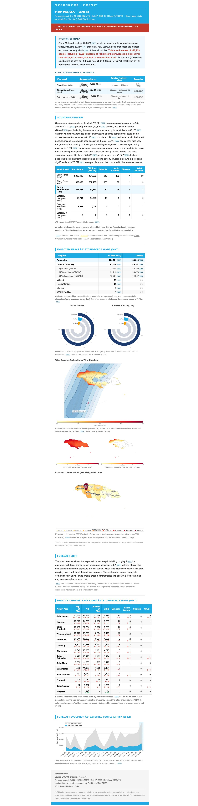
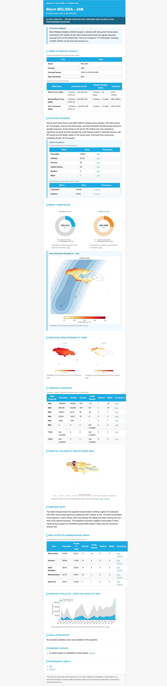
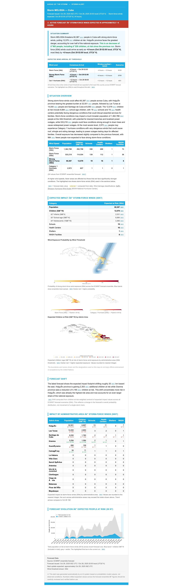
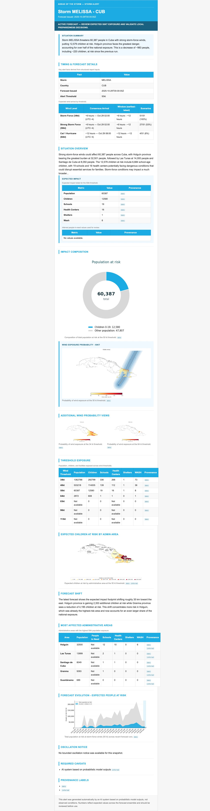

## Evidence Boundary

These cases are historical implementation evidence from specific Forecast Runs. They show what the portable report and alert paths produced for those dates; they are not current operational status, public-release approval, or permanent output goldens.

Report comparisons in these cases were provisional because their expected reports were not independent trusted-current outputs. Alert comparison was a **Presentation Self-Check**: it checked that locally rendered HTML represented local structured claims. It was not independent parity certification. Expected Alert Email HTML did not trigger rendering and was not a generation input.

Baseline Replay was used historically to study bounded prose alignment. It is a non-default, explicitly selected, non-certifying experiment. Current portable generation does not depend on it.

## Dated Cases

| Case | Forecast Run | Historical finding |
|---|---|---|
| Jamaica / Melissa | 2025-10-28 00Z | Provisional report agreement; expected and portable alert screenshots available for visual review. |
| Cuba / Melissa | 2025-10-29 00Z | Provisional report agreement; expected and portable alert screenshots available; PiN composition was omitted when source values were unavailable. |
| Philippines / Hagupit | 2026-05-06 18Z | Provisional report agreement and locally generated visuals; no matching expected alert email was available. |

## Approved Screenshot Evidence

The Jamaica and Cuba screenshots are retained by explicit data-sharing decision. They compare overall information hierarchy and rendering, not exact prose or pixels.

::: {.columns}
::: {.column width="50%"}
### Jamaica expected email

{fig-alt="Historical Snowflake alert-agent email for Jamaica and Melissa at 2025-10-28 00Z."}
:::

::: {.column width="50%"}
### Jamaica portable rendering

{fig-alt="Historical portable alert rendering for Jamaica and Melissa at 2025-10-28 00Z."}
:::
:::

::: {.columns}
::: {.column width="50%"}
### Cuba expected email

{fig-alt="Historical Snowflake alert-agent email for Cuba and Melissa at 2025-10-29 00Z."}
:::

::: {.column width="50%"}
### Cuba portable rendering

{fig-alt="Historical portable alert rendering for Cuba and Melissa at 2025-10-29 00Z."}
:::
:::

## What The Cases Taught

- Structured timing, threshold exposure, administrative impacts, and visual availability are stronger comparison surfaces than copied prose.
- Missing evidence should omit or explicitly mark a component rather than fabricate it.
- The portable PiN visual's canonical runtime filename is `people-in-need-composition.png`; it represents forecast-conditioned, wind-integrated need rather than a wind-threshold total.
- Visual review can identify hierarchy and omission problems, but screenshots are not calculation authority.
- Future certification must compare against independently produced expected facts or outputs with trusted provenance.

No procedural commands or local temporary paths are part of this historical record. Operational usage belongs in reference documentation.
